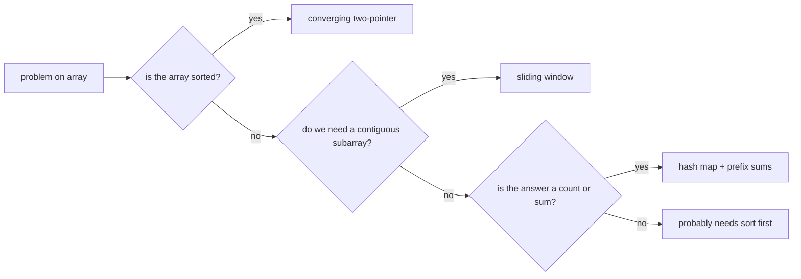
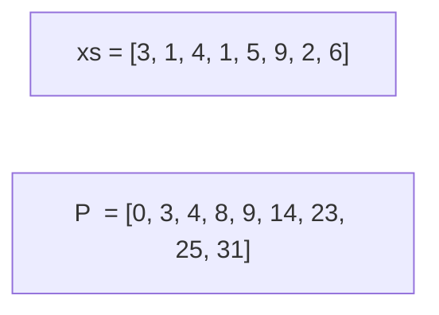

# Module 01 — Arrays and Strings

**By the end you can:**
1. Apply the **two-pointer** pattern to converging, opposing, and meet-in-the-middle problems.
2. Distinguish **fixed-size** vs **variable-size** sliding windows and write a window that maintains a non-trivial invariant.
3. Use **prefix sums** to answer range-sum queries in `Θ(1)`.
4. Recognize when a problem reduces to **Kadane's algorithm**.

**Time budget:** 30 min reading + 4–6 h lab (18 problems).

---

## 1. Why arrays are special

A dynamic array (Python `list`) gives `Θ(1)` indexed access and amortized `Θ(1)` append (CLRS § 17.4). What it does **not** give you cheaply:

| Operation | Cost |
|---|---|
| Insert / delete in the middle | Θ(n) — shifts |
| Find an element | Θ(n) — linear scan, unless sorted |
| Concatenate two lists | Θ(n + m) — copy |

This shapes how you design algorithms over arrays: you pay through the nose for middle-of-array mutation, so most efficient algorithms work with cursors that move in one direction or never move "back" by much.

## 2. The two-pointer family

Three shapes:

| Shape | Setup | When it works |
|---|---|---|
| **Converging** | `lo=0, hi=n-1`, move inward | Sorted arrays; problems with monotone "too big / too small" feedback |
| **Same-direction (fast/slow)** | both start at 0; one moves faster | In-place compaction, cycle detection |
| **Sliding window** | `l=0, r=0`; expand r, contract l | Subarray problems with monotone constraint |



## 3. Sliding window — the invariant

Variable-size window. Maintain the invariant that the window `[l, r]` is the smallest / largest / earliest one ending at `r` that satisfies the constraint. Then the answer is some function of the window's size or contents, taken over all `r`.

Skeleton:

```python
def sliding(xs):
    l = 0
    state = ...  # whatever you track inside the window
    best = ...
    for r in range(len(xs)):
        # extend by xs[r]
        state = add(state, xs[r])
        # shrink while invariant violated
        while violated(state):
            state = remove(state, xs[l])
            l += 1
        # update answer using window [l, r]
        best = update(best, l, r)
    return best
```

Time: amortized `Θ(n)` — `l` advances at most `n` times in total across all iterations of the outer loop.

## 4. Prefix sums

Define `P[i] = xs[0] + xs[1] + ... + xs[i-1]` (with `P[0] = 0`). Then `xs[l] + ... + xs[r-1] = P[r] - P[l]`.



After `Θ(n)` preprocessing, every range-sum query is `Θ(1)`. Combine prefix sums with a hash map to answer "how many subarrays sum to k?" in `Θ(n)` (problem 09).

## 5. Kadane's algorithm

Maximum-sum contiguous subarray in `Θ(n)`. Track the best sum ending at each position; the global best is the max of those.

```
ending_here = max(xs[i], ending_here + xs[i])
best = max(best, ending_here)
```

Why it works: the optimal subarray ending at `i` either extends the optimal one ending at `i-1` or starts fresh at `i`. This recurrence is the simplest example of dynamic programming and we revisit it in module 12.

## How to use this module

1. Read this README.
2. Skim `solutions/` for the pattern templates (`two_pointer.py`, `sliding_window.py`, `prefix_sum.py`, `kadane.py`).
3. `pytest 01-arrays-strings/tests -q` — should be green.
4. Work through `problems/` in order. The first six are easy warm-ups; the medium and hard problems (15: trapping rain water, 17: longest palindromic substring) demand careful invariants.

## Run

```
pytest 01-arrays-strings -q                                       # everything in the module
pytest 01-arrays-strings/problems/09-subarray-sum-equals-k -q     # one problem
```

## References

- CLRS § 17.4 (amortized analysis of dynamic arrays).
- Bentley, J. (1986). *Programming Pearls* — Kadane's algorithm popularized here.
- Sedgewick & Wayne § 1.4 (analysis of dynamic-array operations).
