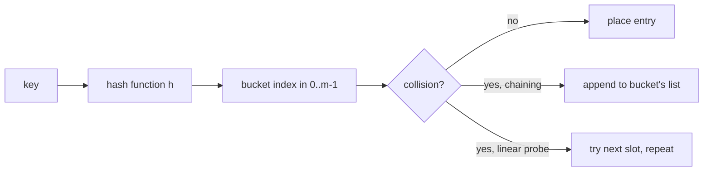

# Module 02 — Hashing

**By the end you can:**
1. Implement a hash table with both **chaining** and **open addressing** (linear probing) and reason about load factor.
2. Use a hash map / set to convert `Θ(n²)` brute force into `Θ(n)` in the canonical interview problems.
3. State Python's `dict` complexity guarantees and explain why "amortized `Θ(1)` insert" is not "always fast".

**Time budget:** 30 min reading + 4–6 h lab.

---

## 1. Hash table — two implementations

A hash table maps keys to values via a hash function `h(k) → [0, m)` and stores the actual entries in an array of `m` buckets. Two collision strategies:

| Strategy | Bucket holds | Lookup on collision | Typical load α | Lookup avg |
|---|---|---|---|---|
| Chaining | Linked list of entries | Walk the list | up to 1.0 | Θ(1 + α) |
| Open addressing (linear probing) | At most one entry | Probe next slot | < 0.7 | Θ(1) when α < threshold |

Both give amortized `Θ(1)` insert / lookup / delete under simple uniform hashing (CLRS § 11.2-11.4) — that is, on average over hash-function choice and key sequence. Worst case is still `Θ(n)` per op if every key hashes to the same bucket.



## 2. Python's dict

Python `dict` uses **open addressing** with a perturbation-based probe sequence. Source: `Objects/dictobject.c` in CPython, particularly `lookdict`. Key properties:

| Op | Average | Worst | Notes |
|---|---|---|---|
| `d[k]`, `d[k] = v` | Θ(1) | Θ(n) | Worst case if a pathological key set defeats hash randomization. |
| `del d[k]` | Θ(1) | Θ(n) | Tombstones are placed; periodic rebuild. |
| `len(d)` | Θ(1) | Θ(1) | |
| iteration | Θ(n) | Θ(n) | Insertion-order since 3.7. |

`set` shares the same backbone.

## 3. When to reach for a hash map

| You see... | Try... |
|---|---|
| "find pair / triplet / k-tuple summing to X" | hash map (or sort + two-pointer) |
| "first / longest / count of substring with property X over characters" | hash map keyed by character |
| "frequency counts" | `collections.Counter` |
| "two structures must have the same shape modulo X" | hash map of canonical form, e.g. sorted-tuple key |
| "find anything in a stream in `Θ(1)` per op" | hash map |
| "detect cycles in a sequence / pointer chase" | hash set |

The cost is **memory**: hash maps trade `Θ(n)` extra space for the `Θ(1)` lookup. On `n = 10^9` keys this matters; on `n = 10^5` it doesn't.

## 4. Multisets — `Counter`

`collections.Counter` is a `dict[hashable, int]` with sensible defaults. Operations:

```python
from collections import Counter
c = Counter("abracadabra")          # Counter({'a': 5, 'b': 2, 'r': 2, 'c': 1, 'd': 1})
c.most_common(3)                    # [('a', 5), ('b', 2), ('r', 2)]
c['z']                              # 0 — missing keys default to 0
```

We use it heavily in "group anagrams", "top-K frequent", and "valid anagram" (problems 7, 9, 3).

## How to use this module

1. Skim this README.
2. Skim `solutions/hash_table.py` (chaining implementation).
3. `pytest 02-hashing/tests -q` should be green.
4. Work through `problems/`.

## Run

```
pytest 02-hashing -q
pytest 02-hashing/problems/01-two-sum -q
```

## References

- CLRS 4th ed. § 11 (hash tables).
- CPython `dictobject.c`: https://github.com/python/cpython/blob/main/Objects/dictobject.c
- Pagh & Rodler (2001), *Cuckoo Hashing* — when open-addressing hits the wall.
