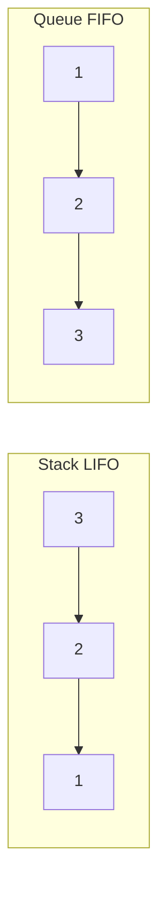

# Module 04 — Stacks and Queues

**By the end you can:**
1. Implement stack and queue both array-backed and linked-list-backed; explain the trade-offs.
2. Spot the **monotonic stack / deque** pattern for "next greater / next smaller / sliding-window max" problems.
3. Use `collections.deque` for `Θ(1)` enqueue / dequeue at both ends.

**Time budget:** 30 min reading + 4–6 h lab.

---

## 1. Stack vs queue vs deque

| ADT | Add | Remove | Built-in (Python) |
|---|---|---|---|
| Stack (LIFO) | top | top | `list.append` / `list.pop` — both `Θ(1)` amortized |
| Queue (FIFO) | back | front | `collections.deque.append` / `popleft` — both `Θ(1)` |
| Deque | either end | either end | `collections.deque` |

**Don't** use `list.pop(0)` for queues — it shifts the whole array, `Θ(n)` per dequeue.



## 2. The monotonic stack

A stack that maintains a strictly increasing or decreasing invariant from bottom to top. Used for problems of the form "for each element, find the next [greater | smaller] element to its [right | left]".

Template for **next-greater-to-the-right**:

```python
def next_greater(nums):
    n = len(nums)
    res = [-1] * n
    stack: list[int] = []        # holds indices
    for i, x in enumerate(nums):
        while stack and nums[stack[-1]] < x:
            res[stack.pop()] = x
        stack.append(i)
    return res
```

**Amortized analysis:** each index is pushed once and popped at most once, so total work across the whole loop is `Θ(n)` — even though the inner `while` can be long on any single iteration. This is the canonical example where the right answer is amortized, not worst-case (CLRS § 17.3, accounting method).

## 3. The monotonic deque (sliding-window max)

A deque that holds indices in strictly decreasing value order. As the window slides, we pop from the back while the new element is bigger (those candidates can never be max again), and pop from the front when the front index falls out of the window. The front is always the window max.

Time: `Θ(n)`. Each index enters and leaves the deque once.

## 4. When you reach for which

| Problem hint | Use |
|---|---|
| "matching pairs / brackets / undo" | stack |
| "first come first served / BFS layers" | queue (`deque`) |
| "next greater / smaller" | monotonic stack |
| "sliding window max / min" | monotonic deque |
| "parse / evaluate expression with precedence" | two stacks (operators + operands) |

## How to use this module

1. Read.
2. Skim `solutions/monotonic.py`.
3. `pytest 04-stacks-queues/tests -q` should be green.
4. Work through `problems/`.

## Run

```
pytest 04-stacks-queues -q
```

## References

- CLRS § 10.1 (stacks and queues).
- CLRS § 17.3 (amortized analysis, accounting method) — covers the monotonic-stack proof.
- `collections.deque`: https://docs.python.org/3/library/collections.html#collections.deque
