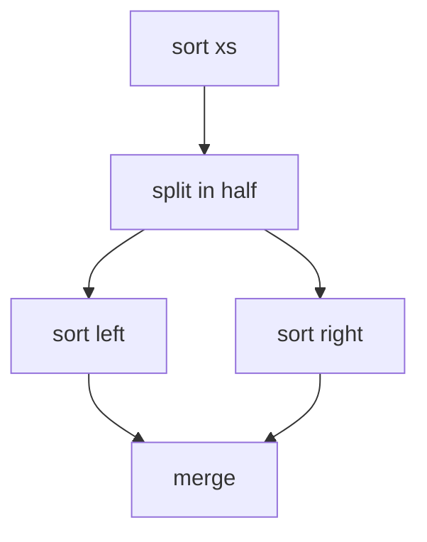
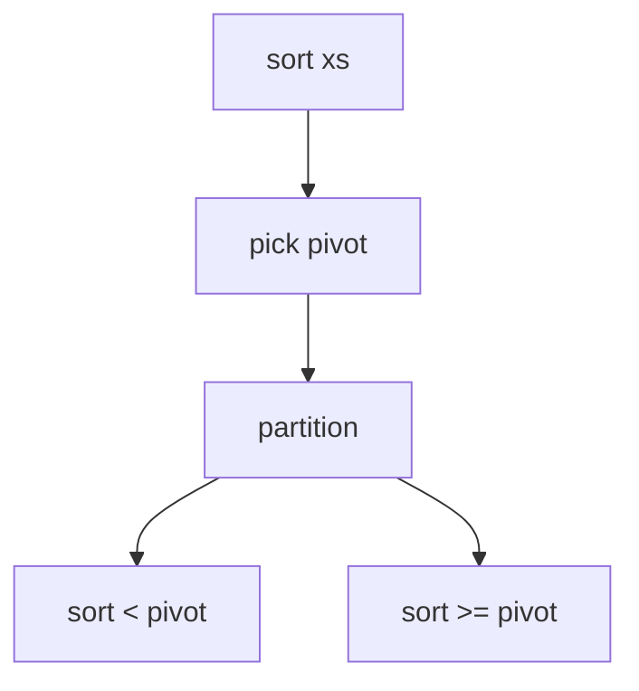

# Module 05 — Recursion and Divide & Conquer

**By the end you can:**
1. Write a recursive solution with explicit base case, recursive case, and a stated invariant.
2. Solve a recurrence with the master theorem (revisit module 00) and tell when it doesn't apply.
3. Implement mergesort, quicksort, and quickselect from scratch with correct partitioning.
4. Recognize when D&C wins over a flat loop and when it loses to cache locality.

**Time budget:** 30 min reading + 5 h lab.

---

## 1. Anatomy of a recursive function

Every well-formed recursive function has three pieces:

| Piece | Role |
|---|---|
| **Base case** | Smallest input handled directly. Without this, infinite recursion. |
| **Recursive case** | Splits the problem into one or more strictly smaller subproblems and combines their answers. |
| **Invariant** | What is true about the function's output for any input, regardless of the recursion path. |

Example — sum of a list:

```python
def s(xs, i=0):
    # Invariant: s(xs, i) == sum(xs[i:]).
    if i == len(xs):
        return 0                # base
    return xs[i] + s(xs, i + 1)  # recursive
```

## 2. When to recurse vs loop

| Tree shape | Reach for |
|---|---|
| One subproblem (`T(n) = T(n - 1) + O(1)`) | Loop. The recursive form is just stack overflow waiting to happen. |
| Bisecting one subproblem (`T(n) = T(n/2) + O(1)`) | Loop **or** tail recursion. |
| Multiple subproblems of similar size | Divide-and-conquer recursion. |
| Tree / graph traversal | Recursion (DFS) or iterative with explicit stack. |

Python has no tail-call optimization. Single-branch deep recursion **will** blow `RecursionError` past `sys.getrecursionlimit()` (default 1000). Convert to a loop or raise the limit (rarely the right answer).

## 3. The master theorem cookbook

(See module 00 for the proof.)

| Algorithm | Recurrence | T(n) |
|---|---|---|
| Binary search | `T(n) = T(n/2) + Θ(1)` | Θ(log n) |
| Merge sort | `T(n) = 2T(n/2) + Θ(n)` | Θ(n log n) |
| Quicksort (balanced) | `T(n) = 2T(n/2) + Θ(n)` avg | Θ(n log n) avg |
| Quicksort (pathological) | `T(n) = T(n-1) + Θ(n)` | Θ(n²) worst |
| Quickselect (balanced) | `T(n) = T(n/2) + Θ(n)` avg | Θ(n) avg |
| Strassen matmul | `T(n) = 7 T(n/2) + Θ(n²)` | Θ(n^log₂7) ≈ Θ(n^2.807) |
| Karatsuba multiplication | `T(n) = 3 T(n/2) + Θ(n)` | Θ(n^log₂3) ≈ Θ(n^1.585) |

## 4. Merge sort



- **Stable**: equal keys preserve their relative input order. (CLRS § 2.3.)
- **Out of place**: needs `Θ(n)` auxiliary buffer for the merge.
- **`Θ(n log n)`** in all cases.

## 5. Quicksort



- **Unstable**.
- **In place**: `Θ(log n)` auxiliary for the recursion stack.
- **`Θ(n log n)`** expected with random pivot or median-of-three; **`Θ(n²)`** worst.

The Lomuto partition is the textbook one; Hoare partition has lower constants and is what `std::sort` derivatives use.

## 6. Quickselect

Same partition as quicksort. After partitioning, only recurse into the side that contains the k-th element. **`Θ(n)`** expected, **`Θ(n²)`** worst. `numpy.partition` does this in C.

## How to use this module

1. Read.
2. Skim `solutions/divide.py` for mergesort and quickselect.
3. `pytest 05-recursion-divide-conquer/tests -q` should be green.
4. Work through `problems/`.

## Run

```
pytest 05-recursion-divide-conquer -q
```

## References

- CLRS § 2.3 (merge sort), § 7 (quicksort), § 9 (selection).
- Hoare, C. A. R. (1962). *Quicksort*. Comput. J. 5(1).
- `numpy.partition`: https://numpy.org/doc/stable/reference/generated/numpy.partition.html
