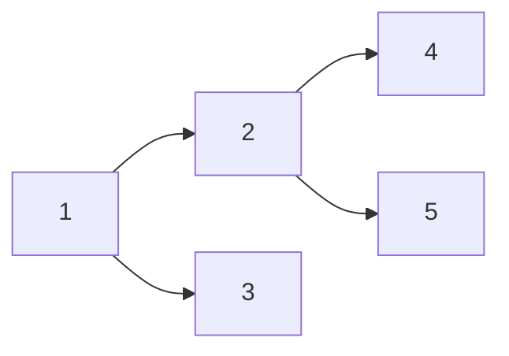

# Module 07 — Trees

**By the end you can:**
1. Implement preorder, inorder, postorder, and level-order traversals — recursive AND iterative.
2. Build a BST and reason about why it degenerates to a linked list under sorted insertion.
3. Distinguish AVL, red-black, and B-trees by their balancing invariants and pick the right one.
4. Apply **Morris traversal** for `Θ(1)` extra-space traversal.

**Time budget:** 30 min reading + 5–6 h lab.

---

## 1. Vocabulary

| Term | Meaning |
|---|---|
| Binary tree | Each node has ≤ 2 children. |
| BST (binary search tree) | Left subtree's values < node's value < right subtree's values (strict in this course; some sources allow `<=`). |
| Balanced | Heights of children of every node differ by O(1). |
| Complete | All levels full except possibly the last, which is filled left-to-right. (Heaps are complete.) |
| Full | Every node has 0 or 2 children. |
| Perfect | Full + all leaves at the same depth. |

## 2. Traversals



| Order | This tree |
|---|---|
| Preorder (root, L, R) | 1 2 4 5 3 |
| Inorder (L, root, R) | 4 2 5 1 3 |
| Postorder (L, R, root) | 4 5 2 3 1 |
| Level-order (BFS) | 1 2 3 4 5 |

All three DFS orders run in `Θ(n)` time, `Θ(h)` space (recursion stack), where `h` is tree height.

## 3. BST invariants and pitfalls

A BST gives `Θ(h)` for search/insert/delete, where `h` is `Θ(log n)` in the balanced case and `Θ(n)` in the worst (sorted insertion). This is why self-balancing variants exist:

| Tree | Balancing invariant | Used by |
|---|---|---|
| AVL | \|height(L) − height(R)\| ≤ 1 at every node | textbook example; some allocator implementations |
| Red-black | every root-to-leaf path has the same number of black nodes; no two red nodes in a row | `std::map`, `java.util.TreeMap`, Linux kernel CFS |
| B-tree / B+ tree | each non-root node has between `t-1` and `2t-1` keys | filesystems, databases (PostgreSQL, MySQL InnoDB) |
| Splay | recently-accessed nodes are rotated to root | not balanced in the same sense; amortized `Θ(log n)` |

We do not implement red-black or AVL in this module (the rotation cases are dense and not great pen-and-paper exercises). The lesson covers them at the invariant level only. CLRS § 13 has the full implementation if you want it.

## 4. Morris traversal — `Θ(1)` space inorder

Standard inorder uses `Θ(h)` stack space. **Morris** weaves the tree with temporary back-edges from each subtree's rightmost node to the current node; after visiting it removes them. Result: `Θ(1)` extra space, two passes over each edge → `Θ(n)` time.

Use when memory is tight and the tree fits in RAM but the stack wouldn't. Reference: J. M. Morris (1979).

## How to use this module

1. Read.
2. Skim `solutions/tree.py` and `solutions/traversal.py`.
3. `pytest 07-trees/tests -q` should be green.
4. Work through `problems/`.

## Run

```
pytest 07-trees -q
```

## References

- CLRS § 12 (BST), § 13 (red-black trees), § 18 (B-trees).
- Morris, J. M. (1979). *Traversing binary trees simply and cheaply.*
- Sedgewick & Wayne § 3.3 (BST), § 3.5 (red-black).
