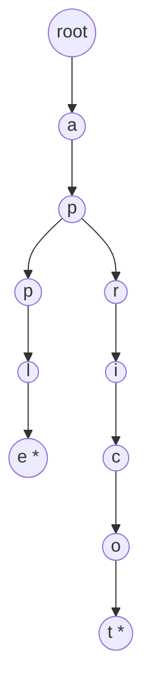

# Module 10 — Tries and String Matching

**By the end you can:**
1. Implement a trie (prefix tree) and use it for prefix queries, autocomplete, and word-set membership.
2. Implement KMP, Z-algorithm, and Rabin-Karp from scratch and explain when each is the right choice.
3. Skim the suffix-array structure at a level deep enough to know when to reach for it.

**Time budget:** 30 min reading + 5–6 h lab.

---

## 1. Trie



A trie stores a set of strings. Each node owns at most σ children (σ = alphabet size). For a word of length L:

| Op | Time | Space |
|---|---|---|
| insert | Θ(L) | Θ(L · σ) per inserted suffix |
| lookup | Θ(L) | Θ(1) extra |
| prefix exists? | Θ(P) where P = prefix length | Θ(1) extra |
| delete | Θ(L) | Θ(1) |

Compared to a hash set: tries pay σ per node but give cheap *prefix queries* — autocomplete, word-search-on-grid, longest-common-prefix scans, IP routing tables.

## 2. KMP — `Θ(n + m)` exact match

KMP's central object is the **failure function** `f[i]`: the length of the longest proper prefix of `pat[:i+1]` that is also a suffix.

```python
def build_failure(pat):
    f = [0] * len(pat)
    k = 0
    for i in range(1, len(pat)):
        while k and pat[k] != pat[i]:
            k = f[k - 1]
        if pat[k] == pat[i]:
            k += 1
        f[i] = k
    return f
```

Match phase walks `text` linearly; on a mismatch, jump back via `f` instead of restarting at the next text position. Reference: Knuth, Morris & Pratt (1977).

## 3. Z-algorithm — `Θ(n)` per string

`Z[i]` = length of the longest substring starting at `i` that matches a prefix of the string. Build `Z` for `pattern + sep + text`; any `Z[i]` equal to `len(pattern)` indicates a match. Cleaner than KMP for "does P occur in T" because there's no separate fail-link concept.

## 4. Rabin-Karp — rolling hash

Slide a length-m window over `text`, comparing the hash of the window to the hash of `pat`. With a polynomial rolling hash, each slide is `Θ(1)` so total is `Θ(n + m)` expected. Worst-case is `Θ(n · m)` when adversarial collisions force re-checks. Reference: Karp & Rabin (1987).

Best when looking for **multiple patterns of the same length** (compare against each pattern's hash on the fly) or when the alphabet is huge and KMP's `f` table inflates memory.

## 5. When to reach for what

| Need | Pick |
|---|---|
| Single needle in haystack, fast worst case | KMP |
| Find all occurrences cleanly with a one-pass build | Z-algorithm |
| Many short patterns, same length | Rabin-Karp |
| Many patterns of mixed lengths, common prefixes | Aho-Corasick (covered briefly in problem 18 follow-up) |
| Autocomplete / dictionary | Trie |
| Repeated substring queries on a fixed text | Suffix array (intro only) |

## How to use this module

1. Read.
2. Skim `solutions/trie.py`, `solutions/kmp.py`.
3. `pytest 10-tries-strings/tests -q` should be green.
4. Work through `problems/`.

## Run

```
pytest 10-tries-strings -q
```

## References

- Knuth, Morris, Pratt (1977), *Fast pattern matching in strings.*
- Karp & Rabin (1987), *Efficient randomized pattern-matching algorithms.*
- Aho & Corasick (1975), *Efficient string matching.*
- CP-Algorithms — Z-function, suffix array, KMP, Aho-Corasick.
