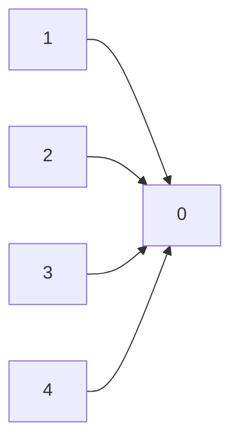
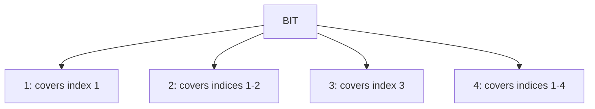

# Module 11 — Union-Find, Segment Trees, BIT

**By the end you can:**
1. Implement Disjoint Set Union (Union-Find) with path compression AND union by rank, and quote the `α(n)` amortized bound.
2. Implement a segment tree for range sum AND range max (and tell when each is the right shape).
3. Implement a Binary Indexed Tree (Fenwick) for prefix sums and point updates.

**Time budget:** 30 min reading + 5–6 h lab.

---

## 1. Disjoint Set Union (DSU / Union-Find)

DSU maintains a partition of `n` elements supporting:

| Op | What |
|---|---|
| `find(x)` | the representative ("root") of the set containing `x` |
| `union(x, y)` | merge the sets containing `x` and `y` |
| `connected(x, y)` | `find(x) == find(y)` |

**With path compression + union by rank**, all ops are `α(n)` amortized — `α` is the inverse Ackermann function, ≤ 4 for any conceivable `n` (Tarjan & van Leeuwen 1984; CLRS § 19).



After path compression, every node points (almost) directly at its root.

## 2. Segment tree

Stores an array of `n` values; supports range queries and point/range updates in `Θ(log n)`. Total nodes ≈ `4n` (heap-style array).

| Variant | Combine | Use case |
|---|---|---|
| Range sum | `+` | "sum of `[l, r)`" |
| Range max | `max` | "tallest building in window" |
| Range min | `min` | "min in window" |
| Range GCD | `gcd` | rarer, same skeleton |

**Lazy propagation** (range *update*): defer pending updates at the parent node; push down on the next query that touches its descendants. Crucial when both queries and updates are over ranges.

## 3. Binary Indexed Tree (Fenwick)

A specialized structure for **prefix-sum range queries and point updates**:

| Op | Cost |
|---|---|
| `update(i, delta)` | Θ(log n) |
| `prefix_sum(i)` | Θ(log n) |
| `range_sum(l, r) = prefix_sum(r) - prefix_sum(l-1)` | Θ(log n) |

BIT has a tighter constant and less memory than segment trees but supports a narrower API. Use it when you only need prefix-sum-style queries.

The trick: each index `i` covers `low_bit(i) = i & -i` elements ending at `i`. Walk via `i += i & -i` to update; `i -= i & -i` to query.



## 4. When to reach for what

| Problem shape | Pick |
|---|---|
| "are these two elements connected?" | DSU |
| "merge groups, count components" | DSU |
| "Kruskal MST" | DSU |
| "range sum / max / min, point updates" | BIT (sum) or segment tree (others) |
| "range update + range query" | segment tree with lazy propagation |
| "kth element in a stream by rank" | BIT over value buckets, or order-statistic tree |

## How to use this module

1. Read.
2. Skim `solutions/dsu.py`, `solutions/segment_tree.py`, `solutions/bit.py`.
3. `pytest 11-union-find-advanced-trees/tests -q` should be green.
4. Work through `problems/`.

## Run

```
pytest 11-union-find-advanced-trees -q
```

## References

- Tarjan, R. E., & van Leeuwen, J. (1984), *Worst-case analysis of set union algorithms.*
- CLRS § 19 (DSU), § 14 (augmented BSTs).
- Fenwick, P. M. (1994), *A new data structure for cumulative frequency tables.*
