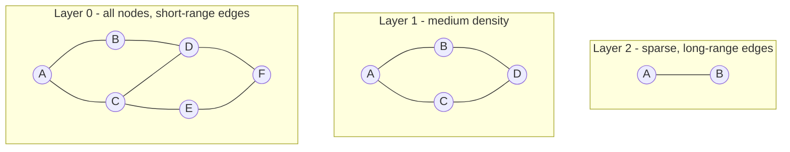

# Module 14 — Capstone: HNSW ANN Index

A from-scratch **Hierarchical Navigable Small World** (HNSW) approximate nearest-neighbor index, plus an **IVF** (inverted file) baseline for comparison. End-to-end: build, query, persist, evaluate recall@k, and profile against a brute-force ground truth.

This is the data-structures-and-algorithms grand finale: priority queues (module 08), graphs (module 09), random graphs and skip-list-style level structure, all on real high-dimensional vectors.

**Time budget:** 8–12 h end-to-end. Read the paper alongside.

---

## 1. The problem

Given a corpus of `N` vectors in `R^d` and a query vector `q`, return its (approximate) `k` nearest neighbors under cosine or Euclidean distance.

| Approach | Build | Query | Recall |
|---|---|---|---|
| Brute force | Θ(0) | Θ(N · d) | 100% (ground truth) |
| KD-tree | Θ(N log N) | Θ(N^(1 - 1/d)) avg | exact in low d, useless past d ≈ 20 |
| LSH (locality-sensitive hashing) | Θ(N · L) | Θ(L · d) avg | tunable |
| **IVF** (k-means + bucket scan) | Θ(N · iters · d) | Θ((nlist's-probed / nlist) · N · d) | tunable |
| **HNSW** (this capstone) | Θ(N log N · d) typical | Θ(log N · d) typical | tunable, very high in practice |

HNSW is the workhorse behind production vector databases (Pinecone, Weaviate, Qdrant, Milvus's HNSW variant).

## 2. HNSW in one diagram



Each node lives in layers `[0, level]` where `level` is drawn from a geometric distribution (probability `1/M` of going up one more level). The top layers are sparse and serve as "highways"; layer 0 contains every node and the densest edges.

**Insertion** (single new vector `q`):
1. Sample `level`.
2. Greedy descend from the top entry point down to `level + 1`, finding the closest neighbor at each layer.
3. From `level` down to 0, run an `efConstruction`-bounded best-first search to find `M` neighbors and link bidirectionally; prune by heuristic if necessary.

**Search** (top-`k`):
1. Greedy descend from top entry to layer 0.
2. At layer 0 run a best-first search with beam size `efSearch`.
3. Return the top-`k` closest results from the candidate set.

Reference: Malkov & Yashunin (2018), *Efficient and robust approximate nearest neighbor search using Hierarchical Navigable Small World graphs.* https://arxiv.org/abs/1603.09320

## 3. IVF baseline

1. Run k-means with `nlist` centroids over the corpus.
2. Each vector is assigned to its closest centroid; we store inverted lists `centroid -> [vector_ids]`.
3. To query: find the `nprobe` nearest centroids to the query, scan only those buckets.

Trade-off knob: `nprobe`. Higher = better recall, slower query. Reference: Jegou, Douze & Schmid (2011), *Product quantization for nearest neighbor search.* (IVF without PQ.)

## 4. What you'll build

`ann/`
- `hnsw.py` — the index (build, add, query, save, load)
- `ivf.py` — IVF baseline
- `distance.py` — Euclidean and cosine helpers (numpy)
- `bench.py` — utilities to time queries and compute recall@k against brute force

`tests/test_hnsw.py` and `tests/test_ivf.py` cover correctness on small synthetic data and a recall threshold (>= 0.9) against brute force.

`notebook.ipynb` walks through:
- Generating synthetic data with controllable structure.
- Building the index.
- Plotting recall@k vs `efSearch` (HNSW) and recall vs `nprobe` (IVF).
- Latency comparison vs brute force.

## 5. Acceptance

- `pytest 14-capstone -q` is green.
- Recall@10 ≥ 0.90 against brute force on 5,000 random vectors in 32 dimensions with default parameters.
- HNSW query is at least 5× faster than brute force at N = 5,000 (a conservative bound; production gaps are 10-100×).

## 6. How to run

```powershell
# from repo root
pytest 14-capstone -q
jupyter notebook 14-capstone\notebook.ipynb
```

## 7. References

- Malkov, Y. A., & Yashunin, D. A. (2018). *HNSW.* arXiv:1603.09320.
- Jegou, H., Douze, M., & Schmid, C. (2011). *Product quantization for nearest neighbor search.* IEEE TPAMI 33(1).
- Indyk, P., & Motwani, R. (1998). *Approximate nearest neighbors: towards removing the curse of dimensionality.* STOC.
- Production reference impls (read for engineering tricks, not for algorithmic correctness):
  - `hnswlib`: https://github.com/nmslib/hnswlib
  - `faiss`: https://github.com/facebookresearch/faiss
