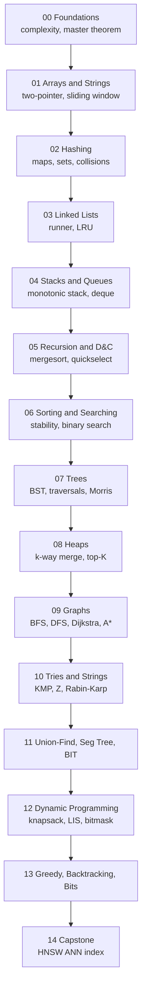

# Data Structures and Algorithms — Beginner to Production

A practice-first, LeetCode-style DSA course in Python 3.11+. Each module gives you a concise primer, annotated reference implementations of the data structures themselves, and 15–20 graded problems with starter files, hidden references, and `pytest` test suites.

Target reader: an AI/ML engineer who wants production fluency — strong enough to reason about algorithmic cost in real systems, not just pass interviews.

## Roadmap

## Modules

| # | Module | Primer topics | Practice (problems) | Tests |
|---|---|---|---|---|
| 00 | [Foundations](00-foundations) | RAM model, recurrences, master theorem, amortized analysis | 18 | `pytest 00-foundations/tests -q` |
| 01 | [Arrays and Strings](01-arrays-strings) | Two-pointer, sliding window, prefix sums, Kadane | 18 | `pytest 01-arrays-strings -q` |
| 02 | [Hashing](02-hashing) | Hash tables, open addressing vs chaining, multisets | 18 | `pytest 02-hashing -q` |
| 03 | [Linked Lists](03-linked-lists) | Singly/doubly, runner technique, in-place reverse, LRU | 18 | `pytest 03-linked-lists -q` |
| 04 | [Stacks and Queues](04-stacks-queues) | Stack, queue, deque, monotonic stack, sliding-window max | 18 | `pytest 04-stacks-queues -q` |
| 05 | [Recursion and Divide & Conquer](05-recursion-divide-conquer) | Recursion patterns, master theorem, mergesort, quickselect | 18 | `pytest 05-recursion-divide-conquer -q` |
| 06 | [Sorting and Searching](06-sorting-searching) | Sort taxonomy, stability, binary search variants, exponential | 18 | `pytest 06-sorting-searching -q` |
| 07 | [Trees](07-trees) | Binary trees, BST, AVL/RB summary, Morris traversal | 18 | `pytest 07-trees -q` |
| 08 | [Heaps](08-heaps-priority-queues) | Binary heap, k-way merge, top-K, median maintenance | 18 | `pytest 08-heaps-priority-queues -q` |
| 09 | [Graphs](09-graphs) | BFS, DFS, topo sort, SCC, MST, Dijkstra, A* | 18 | `pytest 09-graphs -q` |
| 10 | [Tries and Strings](10-tries-strings) | Trie, suffix array intro, KMP, Z-algorithm, Rabin-Karp | 18 | `pytest 10-tries-strings -q` |
| 11 | [Union-Find and Advanced Trees](11-union-find-advanced-trees) | DSU (PC + UBR), segment tree, BIT | 18 | `pytest 11-union-find-advanced-trees -q` |
| 12 | [Dynamic Programming](12-dynamic-programming) | Top-down vs bottom-up, knapsack, edit distance, LIS, bitmask DP | 18 | `pytest 12-dynamic-programming -q` |
| 13 | [Greedy, Backtracking, Bits](13-greedy-backtracking-bits) | Exchange-argument proofs, backtracking templates, bitmask tricks | 18 | `pytest 13-greedy-backtracking-bits -q` |
| 14 | [Capstone — HNSW ANN](14-capstone) | Hand-rolled HNSW + IVF baseline, recall@k, profiling | end-to-end project | `pytest 14-capstone -q` |

Total practice problems: **~252**, mixed difficulty (easy / medium / hard) tagged per LeetCode-style.

## How to use this repo

1. **Install** the toolchain (see [00-foundations/README.md](00-foundations/README.md)).
2. **Read** the module primer (`NN-module/README.md`). 15–25 min.
3. **Open** a problem folder, read `README.md`, fill in `solution.py`.
4. **Run** the test for that problem: `pytest 03-linked-lists/problems/04-reverse-list/tests -q`.
5. **Compare** with `reference.py` only after you've gone green or you're stuck.
6. **Tick the box** in [`progress.md`](progress.md) and run `python -m common.practice next` to see what's up next.

## Pinned versions

| Tool | Version |
|---|---|
| Python | 3.11+ (3.12 recommended) |
| pytest | 8.x |
| numpy | 1.26+ |
| matplotlib | 3.8+ |

Install: `pip install -r requirements.txt`

## Conventions

- Every non-trivial function annotates **time AND space** Big-O in its docstring, worst / average / amortized as appropriate. Citations to CLRS 4th ed. or the canonical paper for non-obvious bounds.
- Idiomatic stdlib used where appropriate, but every data structure is shown hand-rolled at least once in `solutions/`.
- No emojis. Tables over prose. Mermaid for every diagram (renders natively on GitHub).

## Bibliography

See [`resources/bibliography.md`](resources/bibliography.md) for citations. Primary references: CLRS *Introduction to Algorithms*, 4th ed. (Cormen, Leiserson, Rivest, Stein); Sedgewick & Wayne *Algorithms*, 4th ed.; original papers cited in-place.

## License

MIT — see [LICENSE](LICENSE).
